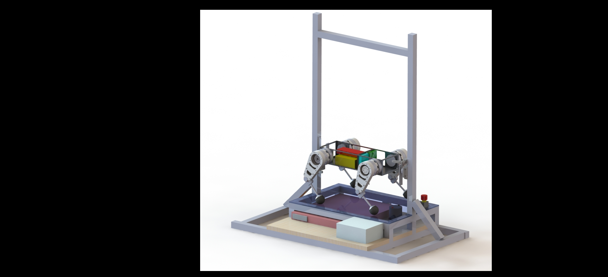

# Lab2
## ME 405 Lab 2 Repository

Our closed loop controller utilizes position feedback to command our test kit motors
to follow a step response and rotate a flywheel 1 rotation. Our controller utilizes proportional control of the form
*K~P~*(*\theta~1~* - *\theta~2~*). We implemented a logical statement that disables the
motor once it has completed one full rotation. The figures below display our progression
of tuning our proportional gain, *K~P~*, to improve the step response.

Figure 1. Step response with input of 1 revolution; *K~P~* = XX.XX. The steady state error is
XX.XX and the response time to steady state is approximately XX.XX seconds. 

Figure 1. Step response with input of 1 revolution; *K~P~* = XX.XX. The steady state error is
XX.XX and the response time to steady state is approximately XX.XX seconds.

Figure 1. Step response with input of 1 revolution; *K~P~* = XX.XX. The steady state error is
XX.XX and the response time to steady state is approximately XX.XX seconds.