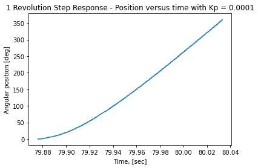
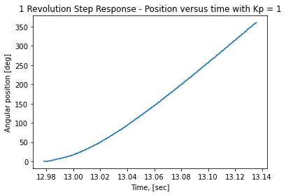

# Lab2
## ME 405 Lab 2 Repository

Our closed loop controller utilizes position feedback to command our test kit motors
to follow a step response and rotate a flywheel 1 rotation. Our controller utilizes proportional control of the form
*KP*(*&theta;ref* - *&theta;meas*). We implemented a logical statement that disables the
motor once it has completed one full rotation. The figures below display our progression
of tuning our proportional gain, *KP*, to improve the step response.

 
Figure 1. Step response with input of 1 revolution; *KP* = 0.0001. The steady state 
error is small and the response is a ramp function, as expected.

 
Figure 2. Step response with input of 1 revolution; *KP* = 1. The steady state 
error is small and the response is a ramp function, as expected.

 
Figure 3. Step response with input of 1 revolution; *KP* = 0.05. The steady state 
error is small and the response is a ramp function, as expected.